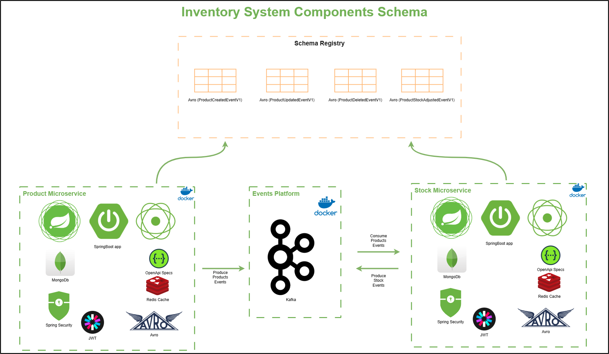
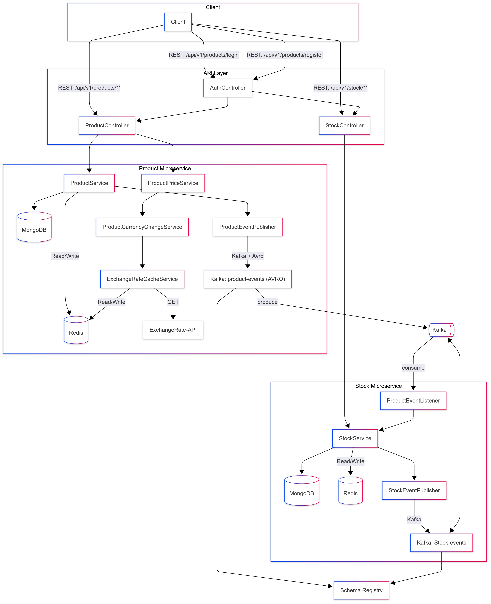

# Product Service

Microservice for product management in the stock system. Built with Spring Boot + WebFlux, JWT security, Kafka + Avro, MongoDB, and Redis.

---

## 🔄 Technologies

- Java 21
- Spring Boot 3
- Spring WebFlux
- Spring Security (JWT)
- Kafka + Avro + Schema Registry
- MongoDB Reactive
- Redis Reactive
- Docker Compose
- Testcontainers for testing
- OpenAPI 3 (Swagger UI)
- MapStruct

---

## 📚 Project Architecture


---

## 🚀 Key Features

- Create, retrieve, update, and delete products.
- Emit Avro events to Kafka when a product is created, updated, or deleted.
- Cache frequent queries in Redis.
- OpenAPI documentation.
- JWT Security: `ADMIN` and `USER` roles.

---

## 📚 Project Flow


---

## 🐘 Kafka Topics

| Event                          | Kafka Topic                 |
|--------------------------------|-----------------------------|
| Product created                | `producto-creado-v1`        |
| Product updated                | `producto-actualizado-v1`   |
| Product deleted                | `producto-eliminado-v1`     |

---
## 🔗 Key REST Endpoints

| Method | URL                                    | Description                          |
|--------|----------------------------------------|--------------------------------------|
| POST   | `/api/v1/auth/login`                   | Login to the system                  |
| POST   | `/api/v1/auth/register`                | Register a new user                  |
| POST   | `/api/v1/products`                     | Create a new product                 |
| GET    | `/api/v1/products`                     | List all products                    |
| GET    | `/api/v1/products/{id}`                | Get product by ID                    |
| GET    | `/api/v1/products/category/{category}` | List products by category            |
| DELETE | `/api/v1/products/{id}`                | Delete a product                     |
| GET    | `/api/v1/products/{id}/price-history`  | Get price history of a product       |

---

## 📆 Installation Requirements

- Docker and Docker Compose installed
- Java 21
- Maven 3.9+

---

## 🛠️ Local Setup

1. Clone the Repository
```bash
git clone https://github.com/santiagoramirez11/mic-product-service.git
cd mic-product-service
```

2. Build the Project
```bash
mvn clean install
```

3. Start the infrastructure:

```bash
docker-compose up -d
```

4. Run the microservice:

```bash
mvn spring-boot:run
```

The application will be available at http://localhost:8080

💡 Key variables in `application.yml`:
- MongoDB URI: `mongodb://mongo:27017/product`
- Kafka Bootstrap Servers: `kafka:9092`
- Schema Registry URL: `http://schema-registry:8081`
- Redis Host: `redis`

🧪 Testing
- Unit tests with JUnit 5.
- Kafka and MongoDB integration tests using Testcontainers.